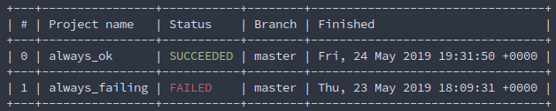
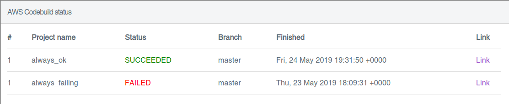

# AWS-Codebuild-Status

Small rust terminal application that list all [AWS-Codebuild](https://aws.amazon.com/de/codebuild/) projects and their current status.

## Preparation

- Create a new IAM User
- The following permissions are needed:
  - Replace `REGION` and `ACCOUNT`

``` json
{
    "Version": "2012-10-17",
    "Statement": [
        {
            "Sid": "VisualEditor0",
            "Effect": "Allow",
            "Action": [
                "codebuild:BatchGetProjects",
                "codebuild:BatchGetBuilds"
            ],
            "Resource": "arn:aws:codebuild:REGION:ACCOUNT:project/*"
        },
        {
            "Sid": "VisualEditor1",
            "Effect": "Allow",
            "Action": [
                "codebuild:ListBuilds",
                "codebuild:ListProjects"
            ],
            "Resource": "*"
        }
    ]
}
```

## Usage

### Cli

- Download the binary from the release page.
- Start it with `./aws-codebuild-status`

Or

Install it with `cargo install aws-codebuild-status`

#### Provide AWS credentials

The recommended way is to use the aws-cli.
- Run `aws configure`
- Set the AWS Access Key ID and Aws Secret Access Key
- The region should set to the region where all projects are located
    - if not, the default region from aws will be used
- The output format needs to be `json`

As an alternative the environment variables `AWS_ACCESS_KEY_ID` and `AWS_SECRET_ACCESS_KEY` can be set.

The usage of instance profiles is also supported.

### Server

- Download the latest release from the release page
- Start the server with `./aws-codebuild-status_server`
- Open a browser and navigate to `locahost:8081`, it will return a static webpage

### AWS-Lambda

- Download the latest `lambda.zip`
- Open the overview page for AWS-Lambda.
- Create a new Function
    - Choose `Author from Scratch`
    - Give the function a name
    - As runtime select `Provide your own bootstrap`
    - Create the function
- In the box `Function Code` select as `Code entry type` `Upload a .zip file`
    - Select the downloaded `lambda.zip`
- Open the IAM role of the lambda
    - Add the permissions above to the lambda function
- Done

## Screenshots

### Terminal
[](./assets/screenshot_terminal.png)

### Webpage
[](./assets/screenshot_web.png)